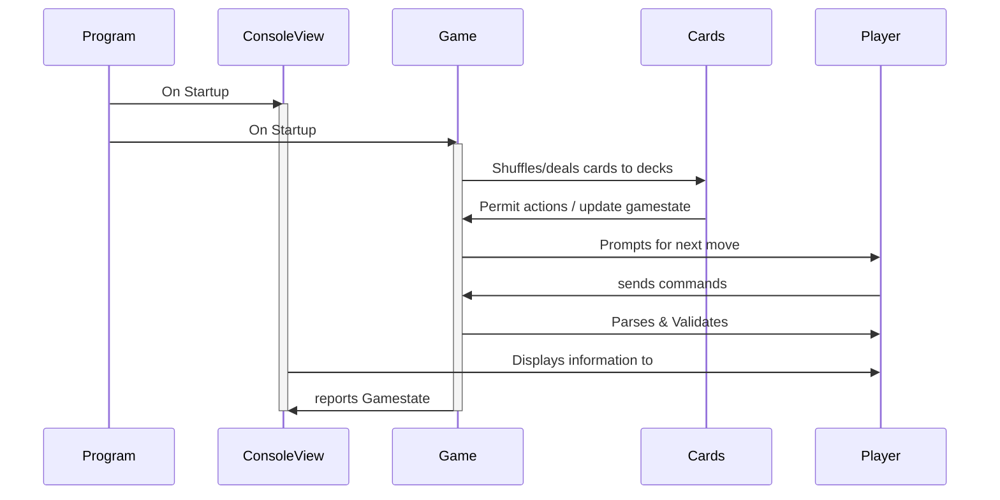

# Space Contest

Space Contest is a card game in a console app based off the popular concepts of deck building games. In this 2 player game, players recruit   mercenaries from the galaxy in an effort to strengthen their forces to take out their opponent before they get taken out. 

## Features

 - console-like interface with "pixel art" representations of cards
 - 140 cards with unique abilities and lots of decisions for the players
 - communicate over telnet with a friend (*planned feature)

## Implementation

 - SpaceContests was originally intended to be a purely console application implementation, but it has become a winforms application to avoid heavy reconfiguration of the windows console to suit the needs of the game.
 - One  aim of the project is to expand the game into a 2 player console-over-tcp app on a server and connect to friends to play. 
 - The code is structured as per classes in the following diagram.

## Getting started

The following commands can be input into the console:

peekHand
peekShop
ShowCard [int; a card reference from 1-5, or multiple ints separated by spaces]
BuyCard [int; a card reference from 1-6]

## Credits & Acknowledgements

 - This app is not written with any affiliations and is intended as an educational exercise primarily; it is not to be shared for public distribution.
- As this app bears similarity to protected properties, the app is private and the characters, locations and settings are delisted from this repository.

> Written with [StackEdit](https://stackedit.io/).
<!--stackedit_data:
eyJoaXN0b3J5IjpbOTAyODE5NjMzLC0xNDk5MDk2MTA1XX0=
-->
